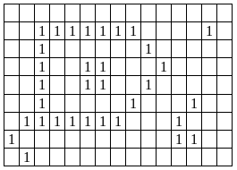

# Satellite

## Instructions
This is a work for analysis of images of rural areas generated by satellite. An image is captured with a camera sensitive to infrared radiation, which differentiates between built-up areas and non-built-up areas. When scanned, the image is divided into a matrix of cells with M rows and N columns. In the scanned image, cells that do not contain any building material are assigned a numeric code 0. Cells that contain some building material are represented by a numeric code 1.
Buildings do not overlap in the image, and distinct buildings are separated by a distance of at least the size of a cell. In this way, a cell with code 1 (marked) belongs to a single construction, and adjacent marked cells belong to the same construction. Adjacent cells are immediate neighbors in vertical, horizontal, or diagonal directions. One building can be surrounded by another, as shown in the figure below; in this case, the constructions must be considered distinct (the figure has four constructions).



## Task
Your job will be to write a program that, given a file containing a digitized satellite image, mounts the image and checks the amount of constructions contained in the area.

## Data Input

An image is stored in a text file whose name must be informed to the program as a command line argument. The first line of the file contains two positive integers, M and N, separated by spaces, which indicate, respectively, the number of lines and columns of the image to be analyzed. The next M lines contain N digits each (separated by spaces) corresponding to the image sent by the satellite. For example, the image above would be encoded in a file with the following content

```
9 15
0 0 0 0 0 0 0 0 0 0 0 0 0 0 0
0 0 1 1 1 1 1 1 1 0 0 0 0 1 0
0 0 1 0 0 0 0 0 0 1 0 0 0 0 0
0 0 1 0 0 1 1 0 0 0 1 0 0 0 0
0 0 1 0 0 1 1 0 0 1 0 0 0 0 0
0 0 1 0 0 0 0 0 1 0 0 0 1 0 0
0 1 1 1 1 1 1 1 0 0 0 1 0 0 0
1 0 0 0 0 0 0 0 0 0 0 1 1 0 0
0 1 0 0 0 0 0 0 0 0 0 0 0 0 0
```

The program should be called `satellite` and have the following usage:

`satellite <image>`

where `<image>` is the name of a file containing an image as described above.

## Output
The program must calculate the number of cells in the image, dynamically allocate it in memory and count the number of constructions contained in the area. For example, if the image above is in a file called `example.txt`, running the program with the following command line:

`./satellite example.txt`

should return the following output:

```
Examining image example.txt
Number of cells in the image: 135
Number of buildings: 4
```

When called without any arguments, the following information should be displayed:

`./satellite`
```
Usage: satellite <image>
<image>: name of the file containing the image
```